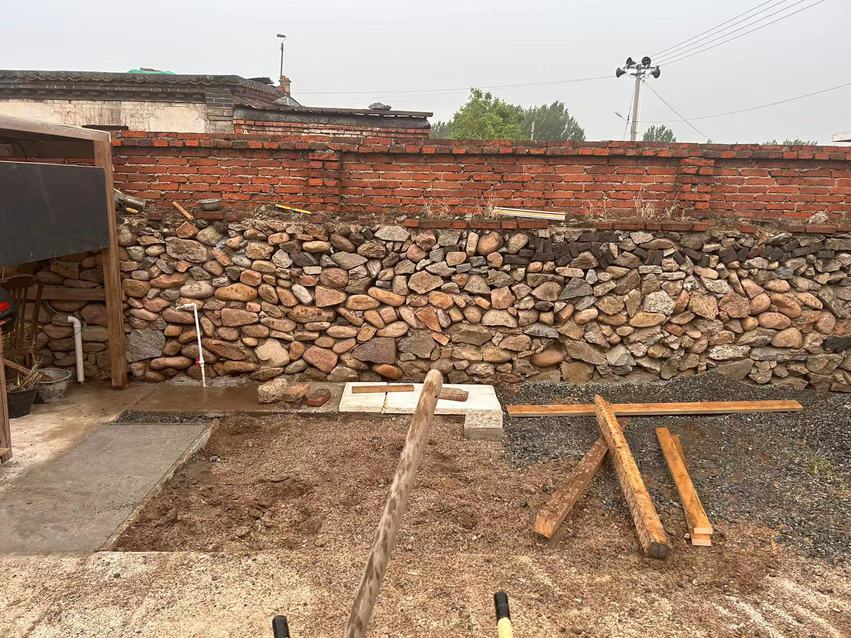

started from the east side box

brace up the structure

add stud walls

from another angle

now do the west side box

cutting top of the pillars, so that beams from front and side can both have solid wood support

not hard to do even with hand tools only

