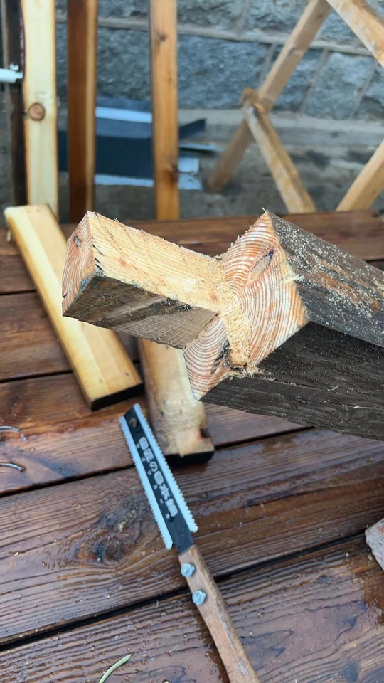
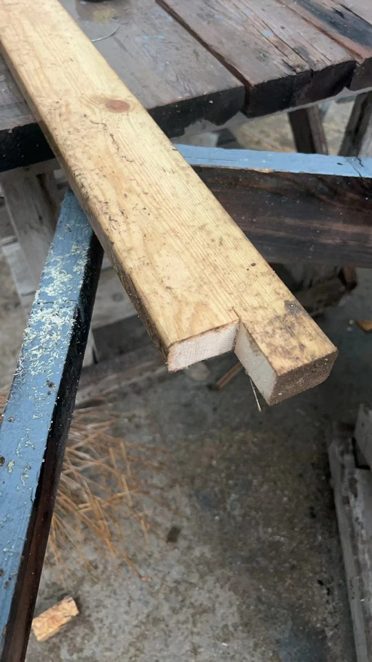
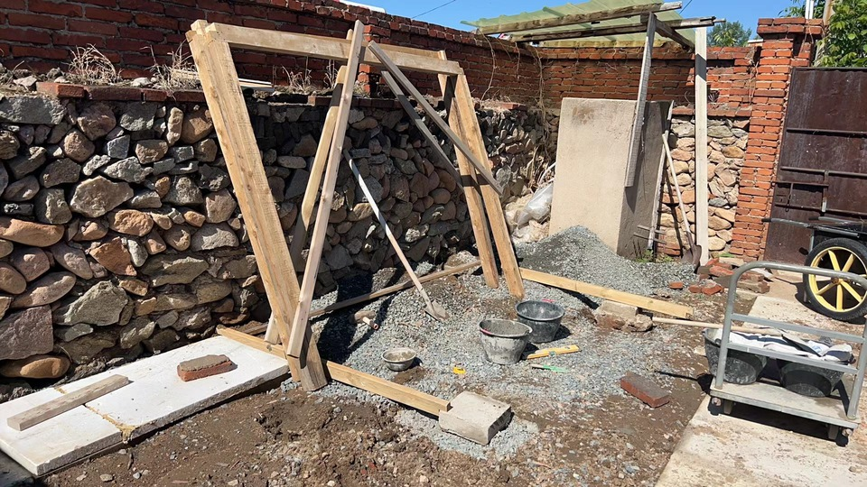
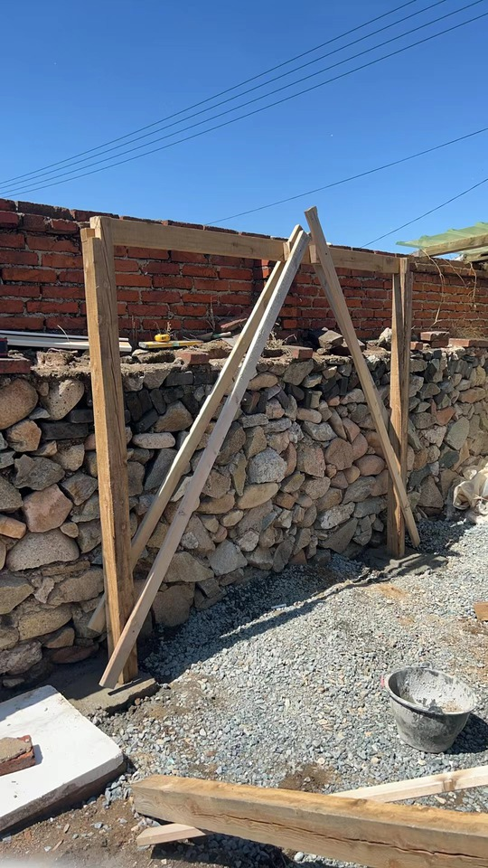
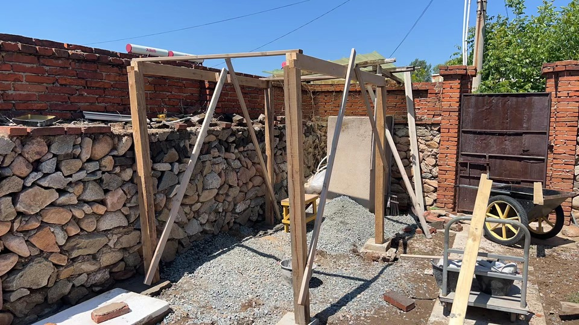
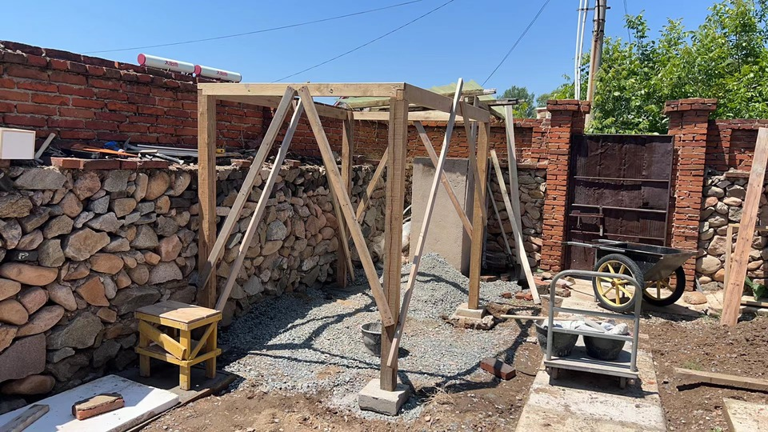
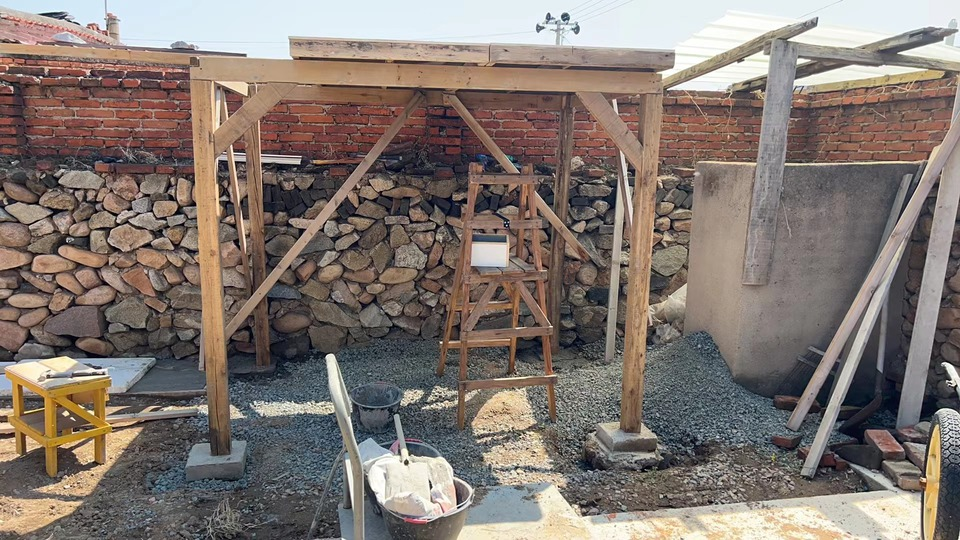
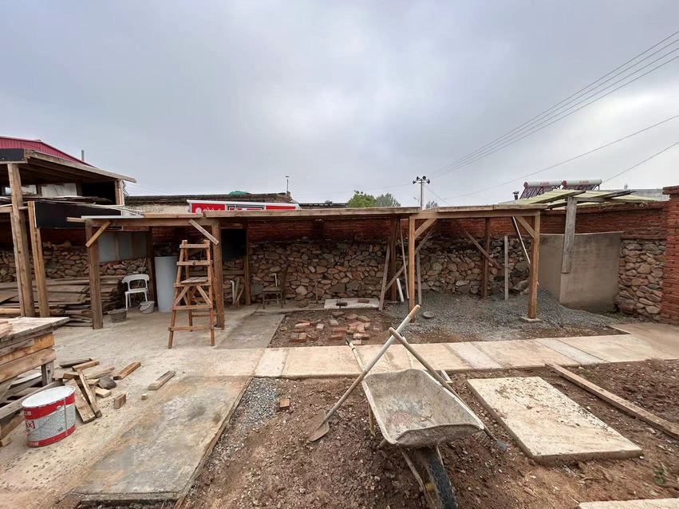

## Box House Phrase 2

you don't want nails to hold your beams, so cutting the tennons for cross-lap joint is the way to go. good news is, this is not hard even with just hand tools.

- having beams on all four sides(rather than just two) have several benifits:
  - NO.1 the frame is now a perfect box
  - NO.2 stronger left and right side braces are now easy to install
  - NO.3 the left/right beams can be used to hold left/right side roof extensions, like the result I have at the end of this phrase 

this does not mean having just the front/back beam won't work, or some times even work better. but the four beams solution is what I love and will probably stay with in the future.

a bugfix here, the tmp braces I orignally have would be hard to remove, cause once the wall installed, they with sit between the wall, can yard wall, so I have to take them to the other side of the wall.

use two tmp top plate to stand up the structure

now the building process, goes mostly like:
- check square, add tmp bracings, 
- install components, like permanent braces, or shear walls
- repeat

the finally brige roof are not strong enough, if I want it the be the floor of second storey in future plans for phrase 3.

the 3.1m span requires two strong beams go across. this is a TODO.

