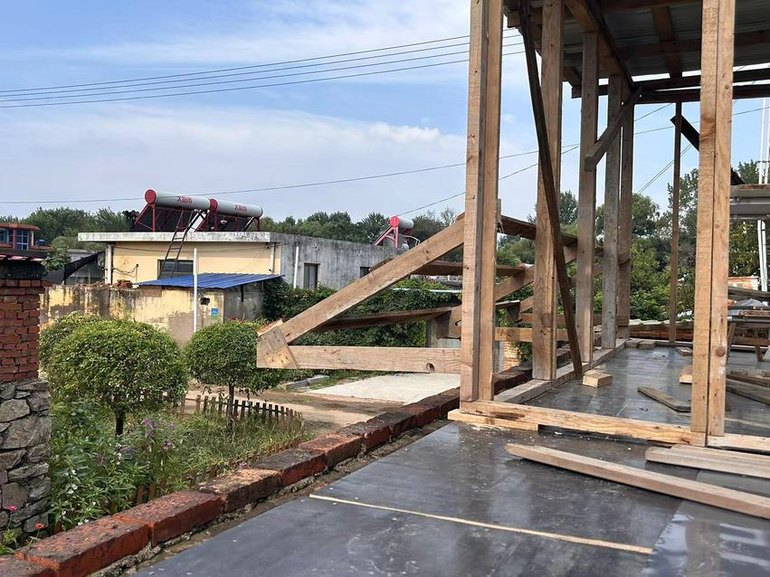

do multi-pass to cult the slot, design the slot 1 or 2 cm smaller than the strecher, then fine adjust tablesaw to remove material from the ends of strechers, until u reach a tight fit. in other words, design the size and postion of the opening/slot, and cut them, then try to fit in the strecher, measure-mark-cut does not work.

