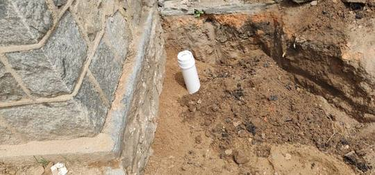
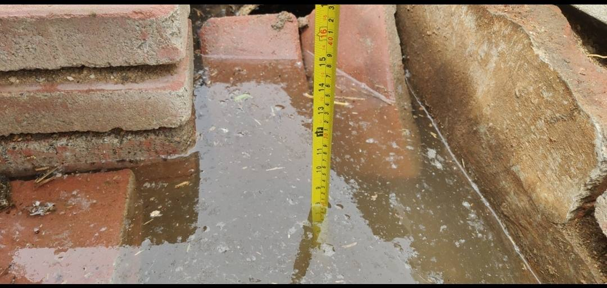

## windows/doors
  - people said, the glazing is `5cm(glass)*2+18mm(air gap)` thick, real number is 24mm
  - people said the thickness of the frame is 70mm(thickness), which is very generous.
  
## yard wall
  - use wood on top of stone is good idea https://youtu.be/t4_2pRnSN4E?t=28
- sewer pipe https://www.bilibili.com/video/BV1eA411x79o
- rock road https://www.bilibili.com/video/BV1eA411x79o?t=9m

## Gateway
  - have expansion joint to do the work in multiple days https://youtu.be/h7tIjBEPiPU?t=275
  - a concrete road is the best and most expensive one that I can build on my own, so the first question is do I really need it, will brick paver or stepping stone will do.
  - keep a slope to drive water away
  - make sure the foundation is strong, or make the concrete no less than 5cm thick
- Walkway
  - dont use concrete, use step stones https://www.bilibili.com/video/BV1k44y1q7en
  - how to build stones with concrete https://www.youtube.com/watch?v=Ey_yiH7jiQY
  - how to build a form https://www.youtube.com/watch?v=rU7S5IUcfXM
  - use mesh https://youtu.be/rU7S5IUcfXM?t=202
  - one day I may need to resurface the way https://www.youtube.com/watch?v=lkl3bY7Z88k
- use foam as mold https://www.youtube.com/watch?v=Oe_zL0B3EYU
  - use foam as skeleton https://www.youtube.com/watch?v=QGiRFZSLmTU
- don't do concrete when it still freezes at night
- make the whole house sealed well, otherwise a lot of small creature will be
  living in your country house.
- L share pillar to support the broken beam
  - even though the beam is poplar willow, wood is not good, but with that
    kind of thickness, it is more than enough to hold the roof even cracked.
  - I asked the two old man living in this kind of house for all their lives,
    they told me with 100% confidence that it is still as strong.
- driveway
  - https://youtu.be/vK9BRLVAbQQ?t=192

- how to fix the cracked beams
  - Repairing 200 Years old wood Beams https://www.youtube.com/watch?v=R1NA1R6v5FY
- how to break concrete? use pulse drills https://youtu.be/3m8Ka4U6B5s?t=103
  - https://youtu.be/gbXEsDDeZAk?t=724
 
## Plumbing: Drain and Sewer
- data:
  - the outside cleanout is 90cmx30cm to the walls of the house. 
  - when outlet water is 20cm deep, inlet water is at the lower edge of the pipe, that means water can no longer go into the tank. 
  - septic tank
    - the outlet slabs are 60cm deep [img](imgs/20210502/5.jpg) 
    - outlet cleanout is 220cm east of main cleanout center [img](imgs/20210502/6.jpg)
    - inlet cleanout is 120cm west and 70cm south of main cleanout hole center. [img](imgs/20210502/8.jpg)
    - inlet pipe cap is 30cm deep from ground, outlet pipe cap is 10cm. [img](imgs/20210502/9.jpg)
    - inlet concrete structure is 60cm deep from ground
    - the tank is full when inlet pipe cap to water level is 60cm. [img](imgs/20210502/10.jpg)
  - pipes, this is how underground lines go https://happypeter.github.io/githome/imgs/20210502/
- plumbing plan/the design, V4:  
  - NO.1 toliet vent, it is also for septic tank
    - Note: vent for underground P will join this vent here
    - fittings: PVC110*50 san tee, 110mm 45degreex2, 50mm 90degree tee
  - NO.2 45degree turn
    - fittings: 110mm 45degree
  - NO.3 45degree turn
    - fittings: 110mm 45degree
  - NO.4 45degree turn
    - fittings: 110mm 45degree
  - NO.5 cleanout
      - fittings: 110mm san tee,  cap
  - NO.6 45degree turn
    - Fittings: 110mm 45degree
  - NO.7 septic inlet. Scrum may accumulate in the built-in clay thick pipe here, if it get solidified, we have problem. So I need to leave a cleanout here. Make sure the end of the pipe is facing downwards, so that it's hard for rats to come in.
    - Fittings: 110mm a 45degree, a cap.
  - NO.8 cleanout and water pump inlet
    - Fittings: 110mm cap
  - NO.9 vent on the wall, also for exhaust fan, end of main plumbing vent.
    - Fittings: a 50mm vent mesh screen, 4 way Tee.
  - NO.10 Underground P, shared by all floor drains, the inlet of the P is the
    toliet floor drain which also serve as cleanout
    - Note: when 2 conditions met, I don't need to vent the P trap: NO.1 the tail of the P is less then 24inch(60cm), NO.1 the main drain it connects to have a really close vent upstream. It seems both apply to my case. https://youtu.be/T5LdT2lr1lY?t=132 
    - Fittings: 75mm P trap, 4-way-Tee PVC75*50 平面四通
  - NO.11 P joins main drain pipe here. vent goes undergroud to the wall
    - Fittings: 75mm 45degree, 110x75 wye, 75x50 san-tee, 50mm 90degree
  - NO.12 shower drain pipe overpass main drain pipe.
    - Fittings: None.
  - NO.13 kitchen pipe goes in there. 50mm pipe. 
    - fittings: 50mm, 90degree elbow, San Tee,  50x75 45degree, 75mm 45degree
    - Don't use san tee for the vertical connect, if water reach the bottom here https://youtu.be/bbqZ12QhoY4?t=191.
  - NO.14 kitchen pipes join main drain line
    - fittings: 75mm 45degree, 110mm wye reduced to 75mm(PVC110*75)
  - NO.15 vanity, A 50mm P trap setup.
    - Fittings: 50mm 90degree elbow, a P trap, a san tee, a 45degree x 2                , 
  - NO.16 vanity drain line joins main drain here
    - Fittings:  `PVC110*50` Wye x 50mm 45degree
  - NO.17 turn
    - fittings: 50mm 45degree
  - NO.18 a floor drain
    - fittings: 50mm 45degree x 2
  - NO.19 a floor drain
    - fittings: 50mm 45degree x 2

  - to use purchased fittings:
    - 110x50 san-tee: 110 san-tee + 110x50 补芯 
    - 50mm 90degree x 1: 45degreex2
    - 110x75 wye x2: 110 wyex2 + 110x75 补芯 x2
    - 75x50 45degree: 50mm 45degree + 75x50 补芯
- washing machine standpipe https://youtu.be/xpsLXmntINE?t=32
- drain pipe length
  - from house foundation hole to the inlet of septic tank, 4.2m
  - from house foundation hole to the inlet of drywell, 7m
- pipe diamaters, ref: https://m.pchouse.com.cn/x/275/2759828.html
  - toliet: 110mm outside diameter PVC
  - main drain line: 110mm
  - secondary main line: 75mm
  - vent line: 50mm
  - kitchen: 50mm, connected to use secondary main line
  - toliet floor drain: 50mm, connected to washing machine drain
  - shower floor drain: 50mm, connected to washing machine drain
  - washing machine drain: use secondary main line
- Use P, S trap is not safe
  - https://youtu.be/Y2o8upCxcqA?t=256
  - https://youtu.be/zGofkKOP2SU?t=102
  - https://trustfourstar.com/what-is-a-p-trap-for-sinks
- cleanouts
  - where to have them https://youtu.be/bbqZ12QhoY4?t=215
  - right out of house https://youtu.be/Qbf6r3CL8Fg?t=348
  - toliet cleanout https://youtu.be/bbqZ12QhoY4?t=62
- traps and vents
  - add filter at the end the vent line to keep small bugs away
  - p trap
    - the tail should not be too shore to avoid siphon. https://youtu.be/JrNv7svgzco?t=35
  - three floor drains(washing machine, toliet, shower) share one P trap
    - do I need a standpipe for my washing machine drain?
      - standpipe is there to avoid waster overflow for drains that not fast enough
      - I my case my P for washing machine is 75cm gaint pipe, so I probably not need a standpipe
      - however if I find overflow in the future, I will add the standpipe.
    - that is the the P for the middle of the three drain, the one used by washing machine, like https://www.quartzbyaco.com.au/how-to-design-a-bathroom-drainage-system/
    - don't bother to have a cleanout at the bottom/turn the P, make sure the drain cover of the middle/washing machine drain is easy to remove.
    - floor drains tend to dry very often, except the shower floor drain. Sharing means there is always water seal.
  - septic tank and toliet share one vent
  - have vents go alone the roof horizontally is a way to share https://youtu.be/C9Keoe0nh_E?t=102
  - kitchen use one vent, one vent between toliet and washing machine so they share one vent
  - avoid vent below flood level https://youtu.be/xpsLXmntINE?t=243
  - use san tee to join vertial and horizontal https://youtu.be/bbqZ12QhoY4?t=325
  - use 50mm pipes for the vent(1.5 inch according to USA code https://youtu.be/bbqZ12QhoY4?
  - you can have multiple vents all connected to your main vent https://youtu.be/Y2o8upCxcqA?t=164
    - you need grade for the connecton https://youtu.be/bbqZ12QhoY4?t=284
- how to glue PVC
  - Not to glue at all
  - use grinder to get round edge of pipe wall for esay pluging in
  - use grinder to cut pipes https://www.bilibili.com/video/BV1rk4y1k7pw
  - plug everything together, place the whole line where it should go, then mark the angle of all the fittings https://youtu.be/yGgx_UFQIfw?t=183
  - the glue will melt the pipe, so make the pipe surface clean before applying the glue, use right glue for the pipe  https://youtu.be/yGgx_UFQIfw?t=218  you have 5 seconds to do it.
  - push to as far as you can go, trun the pipe a bit to make glue even, hold for 5 seconds https://youtu.be/VqBAMEbo-OE?t=87ß
- DONTs
  - don't expose pipes outside the finished walls, otherwise how can you install a cabinet neatly
  - don't use the main vent outlet too big, otherwise strong wind may
    lead to bounce of toliet water https://youtu.be/Y2o8upCxcqA?t=202
  - don't have a drain you don't use very often, when the water seal dries, it is
    a smell hole.
  - don't use two tees together, use double tee https://youtu.be/xpsLXmntINE?t=214
  - don't make too big slope, you will siphone out your p-trap https://youtu.be/xpsLXmntINE?t=235
  - don't use short radius 90 degree fittings(for toliet or vent, short ones are OK) https://youtu.be/xpsLXmntINE?t=395
  - don't use sanitary tee horizontally https://youtu.be/xpsLXmntINE?t=105
    - use these https://youtu.be/w5fMZBRtQ24?t=132 for horizontally connect two pipes
    - use 45 degree if you want to turn https://youtu.be/xpsLXmntINE?t=113
- toliet
  - from the center of the drain hole to side wall 15inch, the the back finished wall 12inch
    - I will make it 40cm to the finished wall, 48cm to the unfinished wall
    - https://hammerpedia.clickfunnels.com/order-form
- laundry
  - use P for everything https://youtu.be/xpsLXmntINE?t=13
  - you need a vent close to washing machine https://youtu.be/Y2o8upCxcqA
- kitchen
  - silicone to glue strainer https://youtu.be/VqBAMEbo-OE?t=109
- how to bury PVC?
  - at least 900mm under ground, 100mm sand under, 300mm sand above pipe
    - https://baike.baidu.com/item/UPVC%E7%AE%A1/10346548
  - use gravels to build a strong foundation for the pipes https://youtu.be/Qbf6r3CL8Fg?t=144
- septic tank
  - inlet hole center: 97cm deep, outlet hole: 100cm deep(ground to hole center)
  - 2m deep, 3m diameter(enough for ten years use MAYBE)
  - seal pipe penetration https://www.youtube.com/watch?v=QGLTaFf9Z1g
  - well cover the main access top hole to keep rain water away
  - inlet pipe 110mm dia PVC
  - needs to be burried under frozen earth https://www.bilibili.com/video/BV1GE411a73c
  - https://youtu.be/ycrwcFXsAdA?t=32 Use a T pipe for outlet of a septic tank.
  - It's very common to have a one chamber tank, as long as you have a outlet
    pipe going uphill(in the case of my outlet pipe, the outside is 30cm or more higher then inside hole, with inside hole sink in water all the time), neither scum or sludge is a worry, cause inside water level will always be above outlet pipe hole
- leach field
  - I won't use pipes with smalls holes, I use concrete lid to cover the whole area and build concrete spacious channels underneath
    - then I don't need to have filters for the tank outlet, and I don't need to cover the gravels with cloth on the top https://youtu.be/LN4-ZcDuSUs?t=573
  - make the D-box really big, so I may be able to open it and clean the tunnels
  - make sure the underground is easily accessible during rain season, native people sometimes needs to pump the water out from their drywell.
  - why a drywell does not make it?
    - water table not deep enough in my yard
    - but after two resonable big rain with the manhole uncovered, the water level
    is still at the drain, that means the I can fill safe to dump how much water I want, so a leach filed may work well
  - DIY concrete slab https://www.youtube.com/watch?v=Ys26t1daYjw
    - use lots of gravels, and you should keep the dirt away from the gravels https://youtu.be/SjZ95sGaD-k?t=485 I don't use cloth, but slab.

## Plumbing: incoming water/water supply
- east wall(of master house) underground PE hose
  - two PE hose inside a 5cm dia PVC pipe
    - PVC pipe goes from south to north, from 1.5m from south yard wall to the south east corner of the master house.
- insulation
  - 电伴热带 https://www.ixigua.com/7029214543645508107
  - https://www.ixigua.com/6902748767410684424
- use "管道装饰护角" to hide the pipes exposed
- well
  - well pressure tank 压力罐
    - https://happypeter.github.io/githome/imgs/20211113/7.jpg
      - meter reads under 0.1, then the pump starts to work
      - 0.2-0.4 is normal value
      - the tank will supply 1 big bucket of water between each starting of the pump
    - 304 steel, the bottom outlet is for clean out
    - https://happypeter.github.io/githome/imgs/20211113
  - Dia 2200mm Depth 71m
  - 12m deep iron pipe for the soil layer to keep dirty water away
  - water came out at 30m deep
  - PVC pipes
    - to avoid rocks plugging the well
    - as screen to prevent pumping off mud from the wall of well to make the
      water muddy
- prefilter
  - one day maybe I will get a after-filter https://youtu.be/QLm89HA4EFU?t=107
  - pressure https://www.bilibili.com/video/BV1kq4y1G7im?spm_id_from=333.788.dynamic.content.click
  - for big particals, sand, rust...these things are not just bad for human,
    but also may detroy your devices.
- materials
  - PE is more flexiable, used as outdoor water supply, ppr is harder, used as indoor water supply https://zhuanlan.zhihu.com/p/141037695
  - my water main pipe is '白色自来水管子 PE 管' on Pinduoduo
    - diameter 20mm(seems a bit bigger than 20mm, but much much smaller than
    25mm)
    - this is called 4 分管 DN15,https://www.pipestd.com/schedule-std-pipe-1-2-inch-dn15-mm/
    - main land standard, the outside diamater is 20mm, US standard is 21.3mm
    - it is flexible enough to be buried undergrand and adjustable to the form
    changes overtime, therefore is widely used as long distance main city water pipe.
    because it's flexibility, you save a lot of fittings.
    - welding temperature 210 degree C
  - if your supply use 4(20mm) pipe, does not make a lot sense to use 6(25mm) pipe in home https://www.163.com/dy/article/FLHV3S95054034NQ.html
  - join metal pipe with ppr https://youtu.be/aUeyjugrdDM?t=264
  - yard faucet. make a hole on the wall, a faucet for the yard. https://youtu.be/cALQ3PR7k30?t=29
- hot melt 
  - hot melt connection is much secure than threaded connection
    - if buried in wall or ground, hot melt is a MUST
    - https://zhuanlan.zhihu.com/p/111056055
    - hot melt is a great way to connect PE2PE or PPR2PPR, the joint merge in
      molecular level, the binding is even stronger than the material iteself. But
      PE2PPR is not a good idea, since PE and PPR has different molecule. - https://www.betterpipe.com/ppr-pe-hot-melt-connection/
  - water main facuet https://www.bilibili.com/video/BV1HJ411v7Dm/?t=52s
  - hot melt tricks https://www.bilibili.com/video/BV1YE411w7KK
    - PPR needs 2 seconds 260DegreeC contact with the heater
    - rub the model surface when you are done
    - how to do it neatly https://www.bilibili.com/video/BV1if4y1D7kM
      - don't melt too long part of the pipe
- water tank
  - use tank for kitchen and bathroom, but outdoor faucet should connect to
  water main directly for two reasons: NO.1 watering the plants uses lots of
  water, tank will be drained. NO.2 when water main pressure is not enough, then
  tank can not get water, a faucet not using tank is now a backup.
  - for 24hr water supply, I need to install a water tank
    - probably in the room where water main enters the house
- incoming water come into the yard from west side, I suppose
  - I am convinced of this after I did trenches for the sewer.
- have a main valve hidden inside cabinet
- all the joint were well melted together, except the old PE pipe to new PE pipe elbow. It's not as strong as other joint, and the melted material may takes some room inside the pipe. so when have oppotunity, replace that.
- consider install heater and filter for water main, then you have clean and hot water for the whole house https://kids.britannica.com/students/assembly/view/107334
- https://www.youtube.com/watch?v=kSZOXjrAmrQ
  - connect pipe with melt https://www.bilibili.com/video/BV1ME411D7Qp/?spm_id_from=autoNext
  - https://haokan.baidu.com/v?vid=2796391637940590857
  - https://www.bilibili.com/video/BV1a7411H7x5
  - https://www.bilibili.com/video/BV1dv411r77G/
- test if the pipe joints are well sealed https://www.bilibili.com/video/BV1Af4y1U7Wj
- incoming water main valve and filter https://www.bilibili.com/video/BV1Uv411B7g1

## insulations

- why vented attic space?

  - without ventilation, roof gets warm in winter, so you get ice dams https://youtu.be/6F_IkZJ8NOY?t=223
  - ice dam can cause water leaking for your roof https://youtu.be/VcRPGQoeO9Q?t=44
  - ice dams shows up, because your whole roof(with or without attic space)
    is poorly insulated, and you should do sth about your roof.
  - https://youtu.be/Ld8pzIu45F8?t=837: if you just have a r60 roof, you can
    make it unvented in a cold climate because you don't have to vent it to - you need a minimum r38 https://youtu.be/VcRPGQoeO9Q?t=107 - spary foam is the only way to get r38 with given space https://youtu.be/VcRPGQoeO9Q?t=177 - you need 30cm firberglass to reach r38 - Closed-cell spray foam has an R-Value of R6-6.5 per inch.
    control ice daming. (But when the snow is too thick, it will have its own r
    value, and ice daming will happen again, but that's not sth I need to worry
    about)
- how to insulate without attic?
  - have a nice compact roof(as the house was built)
  - use film above plasterboard https://youtu.be/ZLcfYZqpGXQ?t=5
  - bury wood in fiberglass https://youtu.be/ZLcfYZqpGXQ?t=138
  - insulation on top of roof(with air insulation and barrier) also works https://youtu.be/Ld8pzIu45F8?t=1739
  - search '屋顶隔热', I got nice thick foam with foil on one side and glue
    on the other, which I think is a good solution.
- will the ventilation drastically decrease interior temrator
  - It is easy to test by plugging the vent for one day or two.
  - ventilation is kind of necessary, as they say 'if you can not ventilate,
    don't insulate'
- a perfect sealed ceiling
  - MUST: air-proof ceiling, seal even the light holes well
  - and then have vented attic
  - https://www.youtube.com/watch?v=Ld8pzIu45F8
- walls
  - make exterior wind resistant, interior heat resistant
  - Wangpeng suggested if we have thick wall, we don't really need wall
    insulation so much. I aggree, at least not as key as ceiling/floor/windows.

##  windows
  - windows needs to be protected from summer sun https://youtu.be/xepx8yp1IPM?t=206
  - invest in three layer glass windows to save heating cost
  - why not vinle windows?
    - welded corner is not aesthetic https://youtu.be/wyyM5es8MeI?t=34
    - aluminum is much more easier to install(maybe uninstall)https://www.jyjbs.com/lhj/1613.html
  - same logic here, build a shed to shelter the west wall from setting sun

## laundry
- wall hung hampers
- hang basins and everything

## toliet
- how to install wall hung toliet https://youtu.be/UNw3Sy4uP1Y?t=114
  - https://www.ixigua.com/6954746530406334987?logTag=5c74856b7f607572e464
  - https://www.ixigua.com/6976275164212232715?logTag=5f5a21fee8a7ad46cf36
  - https://www.ixigua.com/6964631681210778112?logTag=64515f9d3bb116520a64
  - wall https://www.ixigua.com/6984255064164532743?logTag=d34f0480513741d4e284
- most simple design https://www.bilibili.com/video/BV1L741177RV/
  - if you are not to sensitive to the smell, all it takes is a well https://www.bilibili.com/video/BV197411T7qy no sewer or septic tank needed.
- air ventilation and pipe slope https://youtu.be/e8YpYmGTigI?t=180
  - https://youtu.be/AEJ9tJTs7ro?t=66
- The ideal slope of any drain line is ¼ inch per foot(12inch) of pipe.
  - any plumbing fixture needs a trap to keep the smell away https://youtu.be/gqwAETNyTnE?t=348
  - any trap needs a venting https://youtu.be/gqwAETNyTnE?t=357
    - traps can share one venting
  - still need a indoor toliet for the baby
- how to plump a bathroom https://www.youtube.com/watch?v=bbqZ12QhoY4
  - u can use flush toliet with septic tank https://youtu.be/bHYuyGJzix8?t=89
  - the output of the septic tank could be connected to the sewer pipe
    - you can flush down toliet paper https://www.youtube.com/watch?v=QhyCffNoNS0
      - u just need the drain pipes https://youtu.be/udBaGyzJyU8?t=325
    - you can flush down kitchen waste https://youtu.be/udBaGyzJyU8?t=796
    - don't throw garbages can not be eaten by microbes
    - things you can not do https://www.youtube.com/watch?v=bHYuyGJzix8
    - pipes shall be buried deep to aviod frozening https://youtu.be/KdigJmI-z0w?t=136
  - https://www.zhihu.com/zvideo/1330469929851174912
- structure
  - I check several half-destroyed same style houses in 慕义寨, the wood is in perfect
    condition. Clay is part of the roof, between concrete and grass.
  - walls seperating two rooms are not load-bearing, I may remove them to get
    bigger space.
  - from my obsevation, I don't need to worry about the structure. When a
  - Is cracked timber still safe? Yes! https://www.homesteadstructures.com/blog/why-are-there-cracks-timber-my-new-timber-frame-structure - this firbers are not broken, even a bundle of chopsticks are super
    strong, right, so some gaps along the fiber direction do not hurt the
    structural integrity a lot. - However, if a wood beam has split all the way through, you’ll definitely want to investigate further and test structural integrity.
    house of this type gets too old and some parts start to decay, it starts from thin wood sticks extended
    out side the main roof, 出头的椽子先烂.
- walls
  - the right way to clean the wall https://youtu.be/jSRQRepLnrI?t=277
    - use drill not angle grinder
  - build a stone wall https://www.youtube.com/watch?v=GQ9M0kh8pRk
    - https://www.youtube.com/watch?v=mtQChQXKrkA
  - I may keep some walls un-finished the stone or bricks shall be beautiful
  - I may keep some wall with a concrete finish to get a industrial look
    - I can use white furniture or even install white steel board on the wall
      to make the room bright https://www.bilibili.com/video/BV1Zv411k7zU?t=1m52s
  - drill a hole for sewer https://www.youtube.com/watch?v=ca0va3x2GlI
  - you don't need Putty is you don't mind if your wall is smooth or not
- exterior painting
  - gray walls with a bit white https://www.pinterest.jp/pin/68742177999/
  - expose the stones https://www.pinterest.jp/pin/80290805840569948/
- protect water damaged wall https://www.bilibili.com/video/BV12a4y157WT
- moisture protection
  - https://zhidao.baidu.com/question/217846722.html
- cut a hole on a load-bearing wall
  - https://www.youtube.com/watch?v=xQT_ZasSdos How to Cut a Pass-Through in a Load Bearing Wall | Ask This Old House
- How to chase a wall and fit a metal back box - Chasing a Concrete Wall https://www.youtube.com/watch?v=g_spnVPsJ4I

## Power
- conduit is 1m to the north of above ground PVC 5cm pipe
  - https://happypeter.github.io/githome/imgs/20220327/
- fix PVC_Mini_Trunking to the wall https://www.ixigua.com/7023043781607817742
- my current solution
  - service drop wire 6 or 4 sqmm
  - outlet bus 4 sqmm, but each outlet is 2.5 sqmm
  - the red beaker is between two blue ones in the service meter box is mine
  - circuit breaker panel
    - 2p circult breaker: add live(L) and neutral(N) wire on top and then output at the bottom
      - https://www.bilibili.com/video/BV1ZJ41187GC
  - 零排 Neutral bar 和地排 ground bar
    - with leakage protector, you don't need ground wire https://www.ixigua.com/6661773987195912717?logTag=699c489270fdb3f29170
    - in my case I dont need a neutral bar, only a ground bar
    - https://page.om.qq.com/page/OfKFFcNPdxZpzbov0ByZ-IfA0
    - https://www.sohu.com/a/210748647_466936
    - https://www.bilibili.com/video/BV1Jg4y1v7w7
      - ground Bar should connect to the pannel box, then how can I make sure the box is properly grounded itself?
    - not easy to create a ground wire https://www.ixigua.com/6914943936633307661?id=7012258457906577924&logTag=fb576b77436ce657508c
    - the problem without a ground wire
      - https://www.ixigua.com/6860738537499656717?logTag=64d0ebef3f85ba82c1dd
      - it is the default in countryside https://www.ixigua.com/6870705692689465863?logTag=4d42b9887120471f9104

- connect cable soft to hard https://www.youtube.com/watch?v=KETdXX_hzP0
- 空开，空气开关 circuit breaker panel 和漏洞保护器 earth leakage circuit breaker(ELCB)
  - c16 means 16A C25 means 25A
  - https://www.bilibili.com/video/BV14h411Z7ir/?spm_id_from=autoNext
   leakage protector works when a human being touched the power
  - you can add two wires to one output of the breaker, even when the wires are not of same thickness
- switch/sockets need to be 36inches away from water https://youtu.be/NfRuLlTp5s8?t=442
- 漏电保护器 leakage protector is a MUST HAVE, Elon pluged a knife into a socket today.
  - how to install a braker https://www.youtube.com/watch?v=mYJTFMqJFS4
  - https://www.ixigua.com/6924731677830808071?logTag=69a1119c1c6516c2b8d2
    - ususally you don't need this for light ciruit, only power outlet circuit
- how to differentiate Neutral wire, Live wire and ground wire https://www.zhihu.com/zvideo/1354431516022386688
- how to connect two wires at the same time, make sure the connections are not together, keep ceratin distance to make sure they don't heat each other

- only power receptables needs leakage protector, light cable does not
  - https://www.ixigua.com/6914943936633307661?id=6925157977683034637&logTag=16cb55eee593b98936b5
- how to check if a socket is properly grounded, use two 
- 4sqmm for air conditioning, 6sqmm for heater
  - https://zhuanlan.zhihu.com/p/71841887
- hide cords in PVC pipe is common practice
  - use fire-proof pipes, PVC is qualified
  - leave enough space for air to go through
- electric radiator can not be connected to common socket
- fridge needs it's own low votage switch
- power meter
  - the number on it is how many kw you've consumed
  - the fourth switch(red one, new) is connected to my power meter
- the incoming power cable is 6 sq mm, so the maximum power capacity is 6 sq
  mm, right now it is 4 sq mm(copper, installed 18years ago, recommended for 4kw usage) for outdoor cable, indoor is just 1.5 sq mm
- how to fix cord in wall https://youtu.be/ABVi60it-uc?t=27
- all the wiring will be done on the surface, making it easy to modify and
  safe, check https://en.wikipedia.org/wiki/Dropped_ceiling to see the
  possible danger of hiding cables above a false ceiling

## Basic Info
- Why I love the new githome
  - no tall building in front to stop the light in winter and wind in summer
  - septic tank in the yard
- structure
  - roof is build with a once piece concrete thing, felt safe walking on top
- sizes
  - yard: 15.5x48.5 steps, one step is 60cm, so 9.3x29.1sm=270sm
  - wall thickness: some 48cm
  - interior width: 470cm
  - exterior length: some 10m
  - so inside space is: 9mx4.7m=42.3m2
  - ceiling height: 320cm

## Kitchen

- sink counter
  - PDD white cabinet I bookmarked
- floor must be un sticky to stains, choose the right painting
- have two bowl sink, mum will use one as her swill bucket
- fridge should not be put in kitchen
  - hot, close to stove
  - make kitchen hard to mop
  - no need, things in fridge are usually not dirty or leaky
  - dinning room is a good place
- different height for sink and stove https://www.sohu.com/a/161454935_99890682

## Portable Home? or not
- Inflation is here, it make a lot of sense to own my own tools/cars/materials to secure my wealth.
  - Things are also best hedge to my stocks/coins.
- begin with a shipping container workspace https://www.youtube.com/watch?v=bjU7QKcEUFY
- 深河大集 bazzar is the place to buy second hand shipping container houses
- serious considering build with shipping containers https://www.youtube.com/watch?v=LvUI3-0QkI0
  - purchasable in china https://www.bilibili.com/video/BV1dK411J7kS
- drawbacks
  - doing structural work is generally against my philosophy, which is only work on things need to be custimized. Everyone want a strong spacious rooms, that should be build by professionals with large machines, not me by hand.
    - people is building and have done a lot of strong houses, should be cheap to rent
  - even you build with shipping container, you still needs a strong foundation and all the plumbing, and yard and its walls, that's not go without cost.

## Shed
- put it in the west side of the house to keep the wall from setting sun
- for bikes
- tools
- make it portable

## Gate
- refer to https://happypeter.github.io/githome/imgs/20211106
- Mother-son Gate is cool
- final usage width 215cm
- door width 240cm
- width
  - common car with 1.9m
  - 2.4m is good
- ordered Japanese style on PDD
  - 3000RMB
- labor and concrete
  - 1860RMB

## Tools
- impact drill
  - hold fast when you drill sth hard, otherwise it may rotate and hit you.

## Cost
- 浅野水泥 650RMB/20bag
- gravels: 300RMB for more than 2 m3, a tractor
- sand: 300RMB for more than 2 m3, a tractor
- get rid of the junk 300RMB
- interior walls: 12400RMB
  - removing old surface: 1400RMB
  - apply concrete 11000RMB
    - 4.5 people, 30 Oct - 2 Nov 4.5days of really hard work
    - rebuild 3 clay wall, and apply concrete to all interior walls
- gateway: 4000RMB
  - 15cm thick
  - 5people 1.5 days
- false ceiling
  - nails: 200RMB
  - wood frame: 400RMB
  - rocksheet: 600RMB
  - labor: 1800RMB for installing rocksheets
- foamboard: 300RMB per 1.5cubicmeter(CBM)
- hotwater pipe 20mm: `24RMB*8`
- cable
  - 2.5smm: 3RMB*155m 4smm: 30m*3.5RMB
- gate: labor 1400RMB concrete+bricks 460RMB the metal gate 3000RMB
- 4000RMB/year for rent
- 400RMB/year for cleaning
- 159RMB for the ladder
- concrete floor
  - 1200RMB cement and sand
  - 2600RMB labor
- 100RMB for power wiring and outdoor switch
- 18(per bag)x10RMB for cement
- 130(per sqm)x2RMB for sand
- 5(per bag)x2RMB for graval
- PVC pipe
  - 50mm pipe 20RMB/4m x7 total: 140RMB
  - 50mm vent cowl 3.8RMB
  - 50mm elbow with checkout 3.2RMB
  - 75mm diameter 36RMB/4m x2 total: 72RMB
  - 110mm diameter 50RMB/4m x3 total: 150RMB
  - 110mm 45degree elbow 5rmb x 2 total: 10RMB
  - 110mm 45degree elbow 5.6rmb x 2 total: 11.2RMB
  - 110mm stand cleanout 12.5RMB
  - 110mm Tee 9.2RMB x 2 total: 18.4RMB
  - 110mm Wye 14.82RMB x2 total: 29.64RMB
  - 110mm cap 1.5RMB
  - 50mm T with lid 4EMB
  - PVC Glue: 15RMB(for the big can) and 5RMB(for the small)
  - 50mm T(三通) 3RMB x 2 total: 6RMB
- 11.2m twisted steel 44RMB  
- gravels 1cbm 200RMB
- plastic film 143RMB
- mineral wool: 5cm thickness, 600RMB/20sqlm + 160(shipping+transportation)
  = second purchase, 249RMB, 1.2x40m, 10cm thickness
    - 60RMB/sqm to 5RMB/sqm, more than 10 times price differece!
      - but sure this time the dencity is low, cause it is rolls, not boards
- Underfloor Heater
  - 2100RMB for labor
  - 2000RMB for material
- Well
  - 71mx70RMB/m+2360RMB(for 2 IronPipe)
  - pump 1100RMB+wire/rope/pipe 600RMB
- MaterLi
  - 300RMB/day x 6 = 1800RMB for the ceiling
- May Hire: 240 per labor per day, may needs 7 days to finish the painting of
  githome, Putty included. If I want the meterial+labor, it is 25RMB/sqm,
  githome is around 120sqm(wall surface), so it's 3000RMB for water proof
  painting.
- Excavator for cow feeders, trench, hole 900RMB
- 千业水泥 30RMB/bag x 10 
  - by 杨户屯拖拉机胖胖师傅

## Mars workshop
- Enhanced the structure in the center for pendant fan. the virtical wire and the adjacent strips is 3(to the south), 13(to the west and east).
  - 
- cable joint are all close to the ceiling board wholes, for easier maintainance. 

---
title: New House Renovation
---

NOTE: foucsing on things big and hard that I can not take away, while [soho](soho.md) for the lighter & portable.

## rent_requirments

- my dream home
  - a big open space = living room + dinning room + kitchen
    - its really trendy to have open space https://youtu.be/7BB3YYy8RVw?t=60
    - living room is mainly for projector and crafts
    - share sunshine and maybe more importantly share heating
    - kitchen should have bigger countertop than my current one, enough space for both cutting board and draining rack. No small oily corners. preferably enough space for long hanging rod
  - better to have yards
  - bedroom/office for me and Billie each
    - just a big bedroom, big enough and face south
  - a classroom for Kid
    - this should be in its own room, not in the living room
    - so when Elon is taught, Billie or me is two doors away
  - a laundry room with sunshine to dry clothes
  - toliets have part of the day sunshine(e.g facing east/west) and a natural ventilation(a real window)
  - a open balcony
  - so it's
    dream home = (1 big + 4 medium)sunny rooms + (2toilets +
- can I rent a old apartment? yes, the interior look does not matter, search '出租屋 改造‘ on

  - https://www.youtube.com/watch?v=hgcTbLfChV4

- can I rent a poor condition country home(little gated complex)?

  - I am not ready for this.
  - Note all the details in a finished apartment are there for a reason. Not to mention plumbing or heating, even minor things as trims are also cause troble when you try to clean the floor with mop when missing. Sure, you can do that if you want to spend money, but make sure you gurantee a at least 3-year contract with landlord, since it's no small investment.
  - the plumbing is for sure be frozen in winter!!
  - think about how much money to change those poor condition windows to be heating friendly

- requirements

  - network?
  - far enough from noisy traffic?
  - far from noisy dogs?
  - soundproof windows/wall/door
  - proper heating friendly walls/windows?
  - warm bathroom and toilet (consider lady's period)
  - no furniture preferably
  - window size, sunshine
  - DIY tolerant landlord
  - no bugs, espicially those who bite you
  - cooking stove? natural gas?
  - kitchen hood?
  - toliet bowl?
  - windows sealed well? thick walls?
  - noisy? dogs?
  - open space = living room + dinning room + kitchen

- why a poor countryside gated complex?
  - If Musk can build a house on Mars, I can make my accommadation in remote rurals
  - this goal is not to save money, but to understand engineering more deeply, by building things with my own hands.
- design guideline
  - Keyword: standard
    - All the material must be easy and cheap to buy, say I will use concrete to build my sideway, rather than old bricks from old building.
    - Every detail shoud be easily documentable, and every detail is there for a reason, form follows functionality. No fancy tricks for my tempeorary aesthetic taste.
    - the whole design must be very portable to another old country homestead.
    - standardization is a prerequisite for automation
    - think in system, e.g every part of the building should follow the same exterior design and palette.
- the name
  - the gated complex will look techy, demostrate ideas like industrilization and standardization.
- vertical space
  - follow my $shelf_box_system , don't buy things you won't be using for the rest of your life, just for the renovation period. So I will use wood to build my ladders and ladder stools.
- house exterior look
  - white wall + black window/door frame https://youtu.be/qUev14WrTV0?t=86
  - white+black+gray https://youtu.be/p9286KaJjb0?t=35
  - everybody love green plant in front of white wall, interior or exterior https://youtu.be/qUev14WrTV0?t=156
- house entrance
  - a japanese style one/ stwo step stair, keeps the dirt out of house https://www.pinterest.jp/pin/403212972859567897/
  - https://youtu.be/aM8snYZla4Y?t=18
- setup a new water tank
  - concorete path is actually have strong industrial and modern feeling https://youtu.be/qUev14WrTV0?t=123
  - water supply will only avaiable for 2 hours a day
- the garden has it's own well
- toliet connected to a tank with limited capacity
- 2 kitchen dry well
- a open water channel in the south of south building

  - this is what I need to rely on for the water drainage

- build a sidewalk

  - How to Make a Concrete Sidewalk - Do It Yourself https://www.youtube.com/watch?v=h7tIjBEPiPU

- keep house warm in winter
  - baseboard heater https://youtu.be/P6TIY6ATLS4?t=657
  - How to Stop Cold-Air Leaks in Winter | This Old House
    https://www.youtube.com/watch?v=PYOhxK0yauE
- heating friendly windows
  - K < 2.0
  - 塑钢（PVC windows） is the cheapest material to get the K value
  - 中空玻璃(insulating glass) is a must have
  - price 200-300rmb/m2 plus 30rmb installation cost
    - biggest brand 海螺
  - try to rent a house so shabby that the landlord does not mind if I rip off the windows. And try to install new windows in a portable way, so I can take them when I leave.
- rent options
- https://www.bilibili.com/video/BV1Rb411K7HW/?spm_id_from=autoNext
  - all screws, no melding
- https://www.bilibili.com/video/BV1Tb411W7KZ?t=2m26s

  - new air conditioning system, really interesting
    - you don't need to open the window to get the wind!

- https://www.bilibili.com/video/BV1UJ411j7Yh
  - 1080rmb/m2 without finish, done within one month
  - search 三旬一墅, they are professional https://www.bilibili.com/video/BV1Mb411j7zC?from=search&seid=853517654380919168
    - I like light steel structures, since it's much more industrilizable and digitalizable. 三旬一墅 even has version number for the designs.
    - they install solar pannels for EV owners
    - they also have their earth heating system
  - one day I will build a this https://www.youtube.com/watch?v=gJuGjd6yjmY
    - 3x6m, 30,000RMB house!

## soundproof

- 夹胶玻璃 100plus per m2 https://www.bilibili.com/video/BV1PJ411N7J3
- door
  - frame: prefer 多层板 over 密度板
  - inside: 蜂窝纸 is easy to break, 桥洞力学结构 is better
  - 实木复合门 is better than 原木门

## Build your own House

- how to build a wall
  - https://www.youtube.com/watch?v=yJ6i3FRWSGM
- this guy renovated a whole Anhui village https://www.youtube.com/watch?v=8gna8LAVo0M
- old house renovation
  - https://www.bilibili.com/video/BV177411j7eG/
    - this one is of great style, same roof style as mine
      https://www.bilibili.com/video/BV1pV411y7MW/
  - kitchen should own a north window, for esay vent and lighting
  - build a kitchen countertop https://www.bilibili.com/video/BV1FV411z7CC
  - remove the old finish if you want to paint the wall https://www.bilibili.com/video/BV1rJ411X7yF/?spm_id_from=333.788.recommend_more_video.0
  - hange sewer https://www.bilibili.com/video/BV1sK4y147Af?from=search&seid=5095586867679177337
  - paint exterior wall https://www.wukong.com/question/6700549895725515021/
- Not passionate enough to build my own house now, so many houses in China now, so easy to rent, and also wonderful to live anywhere you want.
- https://www.bilibili.com/video/BV1Q5411W7ES/?spm_id_from=autoNext
- https://k.sina.cn/article_6519280980_18494555400100cin0.html
  How to fix the smell in home plumbing.
- you need a air vent for your plumbing https://qastack.cn/diy/128327/should-my-bathrooms-plumbing-vent-be-downstream-of-the-toilet-connection

- shelf diy

  - https://www.youtube.com/watch?v=ksPQLovZiII&t=532s
  - https://youtu.be/eNoOsF-bBoc?t=688

- youtube channel 建房子的豆壳儿
- 轻钢 light steel https://www.youtube.com/watch?v=LmxkUiQ2T_c
  - <1mm thickness, it's really suprising
  - even students can build the house by hand https://youtu.be/UGQfAII0hF0?t=55
  - but the structure is super safe, it actully just need far less steel to hold the weight of everythings, but the problem is steel is easy to be twisted,, that's why people need to use more steel for the structure. Anyway, it's super safe for things like earthquick.
  - https://zhidao.baidu.com/question/246386753619278204.html
  - after years of use, the steel is still 100 percent
    recyclable
  - the wall is also super heat keeping, you save 75% money on heating
  - esay to be prefabricated, industrialization friendly
  - only problem: might produce some noise inside rooms
  - https://youtu.be/XRTNKDUW2uw?t=24
    - 2000rmb/m2 for everything
    - 30w for 150m2
    - https://youtu.be/XRTNKDUW2uw?t=75 you can have a comtempary style hourse with light steel
      - 7200~7500rmb/ton 25~30m2/ton, so for a 150m2 house, the steel is just 50000RMB

## Sewer

- Kitchen sewer tank https://www.bilibili.com/video/BV1uE411q7GJ
- no sewer solution for toilet https://youtu.be/UGQfAII0hF0?t=267
- https://youtu.be/CoFuQZBPCKo?t=213
  - 'sewer systems at their core are a bunch of sloped piped drains that take your waste from your house to a treatment plant...for the most part...Gravaty does all the work'
  - so the slope is key when I try to build my own toliet/kitchen sewer
  - building a home sewer system is not cheap, to have the slope and keep the pipe from frozen, you need to dig deep https://youtu.be/D1cDwRWekD0?t=133 you need digging machines to do the job https://youtu.be/npVOvrDJGsw?t=35
  - how a septic tank works https://youtu.be/udBaGyzJyU8?t=344
    - the water can go out and sink into the soil around it
- how to build a septic tank with bricks https://www.bilibili.com/video/BV1oE411n7uS/?spm_id_from=333.788.recommend_more_video.0

## Solar

- https://www.bilibili.com/video/BV1TA41147Ha/
- 80,000RMB, four year to get all your investment back
  - https://www.bilibili.com/video/BV1wr4y1A7qM
- 3rmb/watt is the current price, 3 year to get all your money back
- 1400w capacity on one typical size country room

## Heating

- burn wood https://www.bilibili.com/video/BV1zT4y1K7fx
- you can build the stove in the center https://youtu.be/RzPCB8ES_xc?t=102

  - stove in the wall https://youtu.be/3n3JWNoUALI?t=129

- it make a lot of sense to have a open space, if you want to save on heating
  - get every functionality really close to each other, share light/air/heat. Keeping people together all the time, human bodies are also heating sources.
- air conditioner
  - cons
    - air exchange with outside, make rooms very dry
    - windy & unconfortable
- baseboard heater
  - most comfortable heater of all kinds
  - no noise
  - best place to put is under a window
  - https://www.bilibili.com/video/BV1zf4y1e7Hw 欧式快热炉 is the best

## Rent Options

- use your imagination, lots of beautiful house in countryside https://youtu.be/IkDIJQo0oj8?t=83

- wood stove/fireplace

  - even artist love it https://youtu.be/p9286KaJjb0?t=125
  - people even build it in tiny house https://youtu.be/UGQfAII0hF0?t=393
  - but I don't think I will use it, I am pro automation, cutting wood is not my thing

- install new windows

  - https://www.youtube.com/watch?v=nZ1HcbA9ugE

- 50cm wall is of the thick category
  - https://youtu.be/tK_8ocvteCc?t=255
- options
  - If I want big house, I can goto 宝坻 https://www.youtube.com/watch?v=HdRLohK6QeA

## Bathroom

- use '丽彩墙板' for the wall https://www.zhihu.com/question/431037652/answer/1583896192
- seperate bath and toliet
  - use glass if you have enough space
  - use cloth if not

## kitchen

- even luxury house use 灶台 https://youtu.be/2zeGHR5vsRs?t=118
- countertop
  - I will build one for my sink counter
    - sth like this https://www.homestratosphere.com/parts-of-table/
  - height without top: 85cm
    - so I need four legs 8x8x85cm(TODO: try to make sure stove counter top height is less than this, then try to make this lower)
      - the top height is 88+topThickness=93cm
    - box apron
      - 2 of 8x12x(topLength-6cm-2x8cm)=8x12x(110-6-16)=8x12x88
      - another 2 of 8x12x(55-16-2)

## Exterior look/painting

- https://www.bilibili.com/video/BV1Wp4y1a7xb
- one storey house https://www.bilibili.com/video/BV1Zk4y1y7xj

## yard

- this feels right https://youtu.be/L8Gdr3XPK9U?t=263

## Basketball

- sth like https://youtu.be/L8Gdr3XPK9U?t=26

## People

- it's possible to live with villagers https://www.youtube.com/watch?v=0YWs_08RpYI

## Solar

- solar car shed https://detail.1688.com/offer/536059778973.html

## Yard Garden

- use abandomed furniture, paint them and use them as flower stand.

## renovation process

- SO: Order windows/doors
- S1: water and power
- S2: water proof for kitchen and toliet
- S3: Install ceiling
- S4: wall and floor tile
- S5.5 Paint the wall
- S6: Install windows/doors
- S7: Curtains and lights

## Capenter Tools

- I want tools in here https://www.youtube.com/watch?v=bOOXmfkXpkM&t=55s
  - lots of practical tricks about how to build walls
- https://www.youtube.com/watch?v=sdr8Zp17o_s Five MUST HAVES
- cicular saw pitfalls https://www.youtube.com/watch?v=YPz1orpvbyI
  - avoid bind against the blade https://youtu.be/VskDj-xO19s?t=612
- work bench
  - https://www.youtube.com/watch?v=Va8tlFpnhRg
  - my workbench has to be modular
  - this looks super easy https://www.youtube.com/watch?v=PMJ4Lob5Q4I
    - use almost just drill and screw
  - this is the easiest one https://youtu.be/UXnEzwJpbBg?t=181
  - features for a work bench
    - https://www.youtube.com/watch?v=8ZmHBquTDX8
      - sheer mass and weight to keep it really stable
      - thick top to keep the noise kocking
      - a vise or two

## concrete

- too much makes the cncrete fragile https://youtu.be/UOHURuAf5iY?t=375 the less water you add, the more strength you get.

## structural change
- add hears before destroying the wall https://youtu.be/3fP0LZMEV5w?t=346
